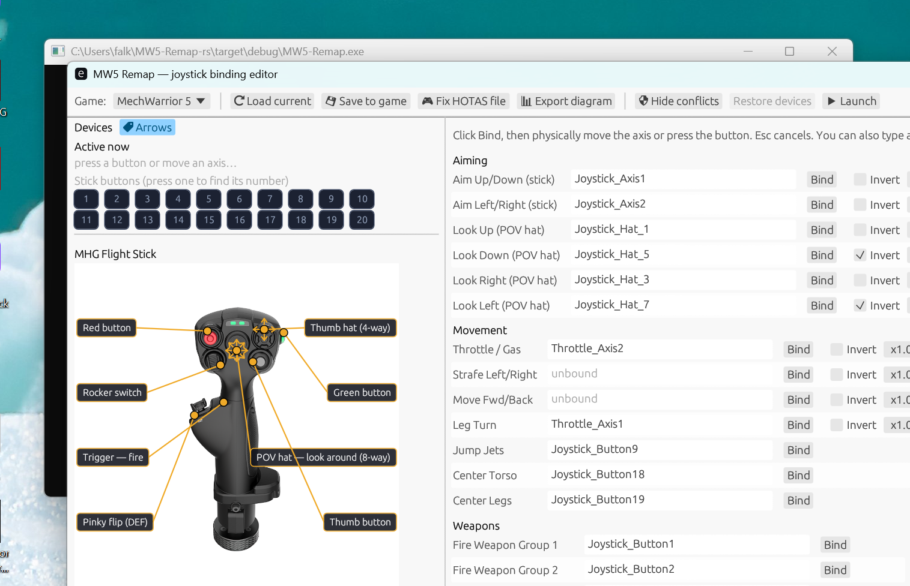
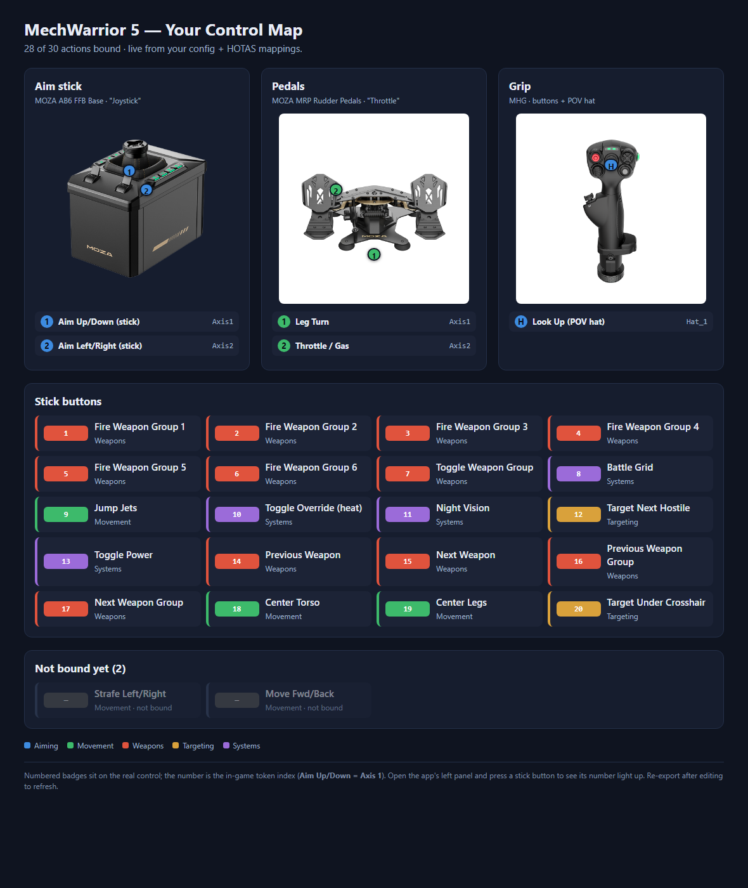

# MW5 Remap

A small, fast **visual joystick binding editor for MechWarrior 5: Mercenaries**. Point-and-click your HOTAS bindings, see them laid out on photos of your real sticks, and — crucially — have them *actually work in-game*, because MW5's joystick input is more complicated than it looks.



## Why this exists

MechWarrior 5 maps a joystick through **two** separate files, and most "it won't bind!" pain comes from only knowing about one of them:

| File | Maps | Edited by |
| --- | --- | --- |
| `SavedHOTAS\HOTASMappings.Remap` | **physical device → token** (`GenericUSBController_Button1` → `Joystick_Button1`), per device by VID/PID | hand-edited (no full in-game UI) |
| `GameUserSettings.ini` | **token → action** (`Joystick_Button1` → `FireWeaponGroup1`) | the in-game controls menu |

If your stick has no block in `HOTASMappings.Remap`, none of its inputs reach the game — so the bindings you set in `GameUserSettings.ini` do nothing. MW5 Remap writes **both** files for you and keeps them consistent.

It also handles two MW5 gotchas:
- **`Joystick_Button21+` is invalid** — MW5 only has buttons 1–20. The editor never emits dead tokens.
- **MW5 rewrites `GameUserSettings.ini` back to stock defaults on launch.** One click (**🔒 Lock config**) makes the file read-only so your bindings persist.

## Features

- **Press-to-bind** — click *Bind*, press the button / move the axis, done.
- **Live device panel** — your actual MOZA AB6 base, MHG grip, and MRP pedals as labelled photos. Numbered callouts (① = Aim Up/Down = `Axis1`) line up with the grid, and they **light up green when you press/move the control** — including a 1–20 button board for discovering which physical button is which number.
- **POV hat → look** in 4/8 directions, with the hat's "ways" drawn as spokes.
- **Writes `HOTASMappings.Remap`** for your MOZA devices (preserving any other devices' blocks).
- **🔒 Lock config** to stop MW5 resetting your bindings.
- **Export diagram** — a self-contained HTML control map built from the real device photos:

  

- **Auto-update** via GitHub Releases (native WinHTTP, no extra runtime).
- Every write is **backed up** first (to `%LOCALAPPDATA%\MW5-Remap\backups`).

## Install

1. Download **`MW5-Remap-Setup.exe`** from the [latest release](https://github.com/falkoro/mw5-remap/releases/latest) and run it. It installs per-user (no admin) so the in-app updater can replace itself freely.
   *(Or grab the standalone `MW5-Remap.exe` and run it directly.)*

## First-time setup

1. **Launch MechWarrior 5 once**, then quit — this creates the config files.
2. Open MW5 Remap, pick your bindings (or start from the built-in defaults).
3. Click **🎮 Fix HOTAS file** — writes your MOZA stick + pedals into `HOTASMappings.Remap`.
4. Click **💾 Save to game** — writes the token→action bindings.
5. **Test in-game.** If your bindings revert after relaunching MW5, click **🔒 Lock config** and they'll hold. *(While locked, in-game graphics/audio settings won't save until you unlock.)*

> Close MW5 before saving — it overwrites its config on exit.

## Hardware

Built and tuned for a **MOZA AB6 FFB base + MHG grip** (the "Joystick") and **MOZA MRP rudder pedals** (the "Throttle"), but the file formats and most of the app are generic. The default layout maps:
- Stick gimbal → aim (pitch/yaw), grip buttons → weapons/systems, POV hat → look.
- Rudder slide → turn legs (left/right); press a toe pedal → throttle/forward.

## Command line

The same actions are scriptable (handy for headless fixes):

| Flag | Does |
| --- | --- |
| `--write-hotas` | write/refresh the MOZA blocks in `HOTASMappings.Remap` |
| `--force-defaults` | overwrite every action with the known-good default layout |
| `--apply-defaults` | fill only *unbound* actions from the defaults |
| `--lock` / `--unlock` | toggle the read-only lock on `GameUserSettings.ini` |
| `--diagram` | export the HTML control map next to the exe |
| `--devices` | list connected joysticks (role, axes, buttons, live tokens) |
| `--selftest` | round-trip + structural integrity check on a temp copy |

## Building from source

See [CONTRIBUTING.md](CONTRIBUTING.md) for the toolchain, architecture, and release process. Short version:

```sh
cargo build            # debug (shows a console for CLI output)
cargo build --release  # release (windowed, no console)
```

## License

[MIT](LICENSE) © Falkoro
